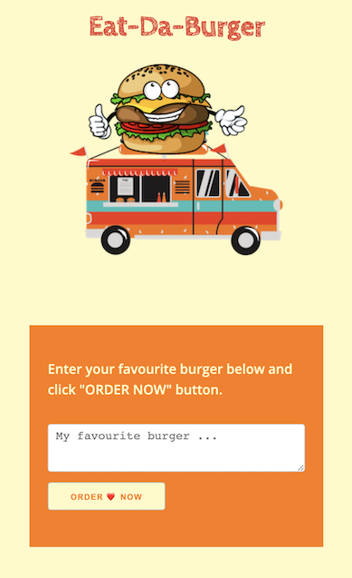
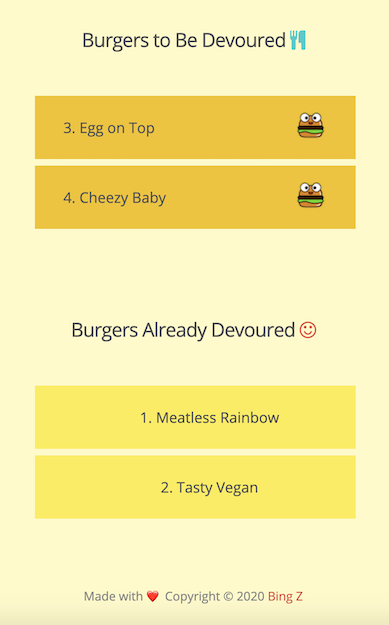

# Burger Order App
<hr>

  [](https://github.com/imbingz)
  [](https://github.com/imbingz/Order-Devour-Burger)
  [](https://github.com/imbingz/Order-Devour-Burger)
  [](https://choosealicense.com/licenses/mit/)
  [](https://nodejs.org/en/)
  [](https://www.npmjs.com/package/inquirer)

  ## Table of Content
  * [ Project Links ](#Project-Links)
  * [ Screenshots-Demo ](#Screenshots-Demo)
  * [ Project Objective ](#Project-Objective)
  * [ User Story ](#User-Story)
  * [ Technologies ](#Technologies)
  * [ Installation ](#Installation)
  * [ Usage ](#Usage)
  * [ Credits and Reference ](#Credits-and-Reference)
  * [ Tests ](#Tests)
  * [ Author Contact ](#Author-Contact)
  * [ License ](#License)
  #

  ##  Project Links
  [Heroku Deployed Site -Burger Order App](https://boiling-meadow-98427.herokuapp.com/) <br>


  ## Screenshots-Demo
  <kbd></kbd><br><br>
  <kbd></kbd>
  <kbd></kbd>
  
  ## Project Objective
  To create a burger logger with MySQL, Node, Express, Handlebars and a homemade ORM (yum!). Be sure to follow the MVC design pattern; use Node and MySQL to query and route data in the app, and Handlebars to generate the HTML.

  * Eat-Da-Burger! is a restaurant app that lets users input the names of burgers they'd like to eat.
  * Whenever a user submits a burger's name, the app will display the burger on the left side of the page -- waiting to be devoured.
  * Each burger in the waiting area also has a Devour it! button. When the user clicks it, the burger will move to the right side of the page.
  * The app will store every burger in a database, whether devoured or not.
  
  ## User Story
  As a Burger-Joint owner, I want my customers to be able to input and order their favorite burgers and pick up the order when it is ready (devour it). I want all the burgers regardless devoured or not to be stored in the database So that I can analyze the data and make better business decisions. 


  ## Technologies 
  ```
  Javascript, jQuery, node express.js, express-handlebars, npm, mysql, 
  ```
  
 ## Installation
  Access to GitHub.com and a code editor such as vscode is necessary. Click the GitHub link provided above to the APP REPO. Click on the green button that says Clone or Download and Choose how you would like to download: using the SSH/HTTPS keys or download the zip file. If using SSH/HTTPS Key: You will copy the link shown and open up either terminal (mac: pre-installed) or gitbash (pc: must be installed). Once the application is open, you will type git clone paste url here. If using Download ZIP: Click on Download Zip. Locate the file and double click it to unzip the file. Locate the unzipped folder and open it. 

 ## Usage 
 In order to use this APP, you need terminal (mac: pre-installed) or gitbash (pc: must be installed). You also need to download and install [node.js](https://nodejs.org/en/) and [npm](www.npmjs.com) or [yarn](https://yarnpkg.com/) package manager. Open the cloned REPO in your favorite code editor, make sure you download the package.json, then in terminal, enter the command “npm i" or "npm install"  to install the dependencies [inquirer package](www.npmjs.com/package/inquirer).  Now you are ready to start using  the app by entering “node server.js” on your terminal or gitbash. 
  
  ## Credits and Reference
  The following link(s) inspired and helped me with this project: <br> 
  [www.canva.com](https://www.canva.com/templates/?query=burger) <br>
  [How to deploy to Heroku with database using Jaws_DB Mysql](https://youtu.be/-K9SXlGaQcA) <br>


  ## Tests
  npm test

  ## Author Contact
  Contact the author with any questions!<br>
  Github link: [imbingz](https://github.com/imbingz)<br>
  Email: contact.bingz@gmail.com

  ## License
  This project is [MIT](https://choosealicense.com/licenses/mit/) licensed.<br />

   Copyright © 2020 [BING Z](https://imbingz.github.io/Responsive-Website-Portfolio/)

  <hr>
  <p align='center'><i>
  This README was generated with ❤️ by <a href="https://imbingz.github.io/Responsive-Website-Portfolio/"> BING Z</a>
  </i></p>

